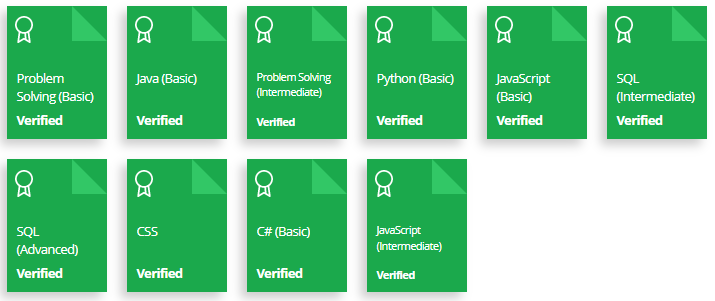

<h1>  Hackerrank-Certificates</h1>
<h3> <a href="https://www.hackerrank.com/tambolisaklait20?hr_r=1">HackerRank Profile<a> <h3>  

<h3>My Certificates <h3>
  <a href="assets/Certificates/C hash BASIC.png">C# Basic</a>
  <a href="assets/Certificates/problem solving basic.png">Problem Solving Basic </a>
  <a href="assets/Certificates/problem solving basic intermediate.png">Problem Solving Intermediate </a>
  <a href="assets/Certificates/Python basic.png">Python Basic </a>
  <a href="assets/Certificates/JAVA BASIC.png">Java Basic </a>
  <a href="assets/Certificates/sql intermediate.png">Sql Intermediate </a>
  <a href="assets/Certificates/SQL ADVANCED.png">Sql Advanced  </a>
  <a href="assets/Certificates/CSS.png">CSS </a>
  <a href="assets/Certificates/Javascript Basic.png">Javascript Basic </a>
  <a href="assets/Certificates/Javascript Intermediate.png">Javascript Intermediate </a>
